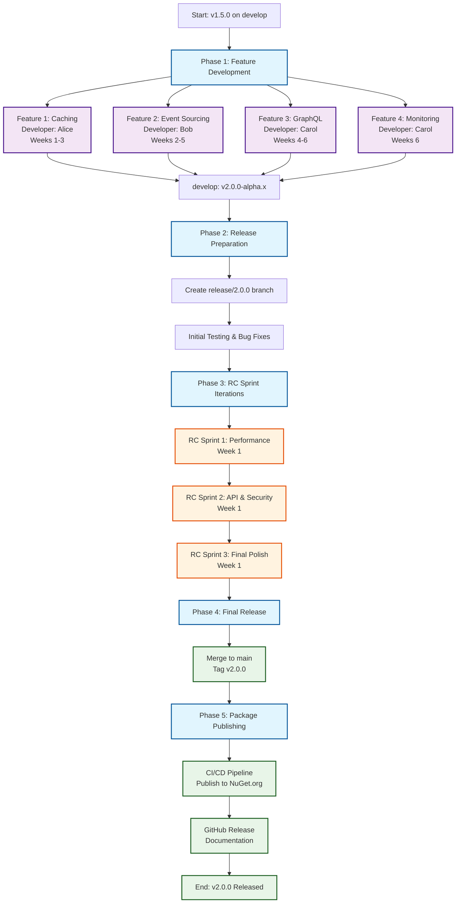
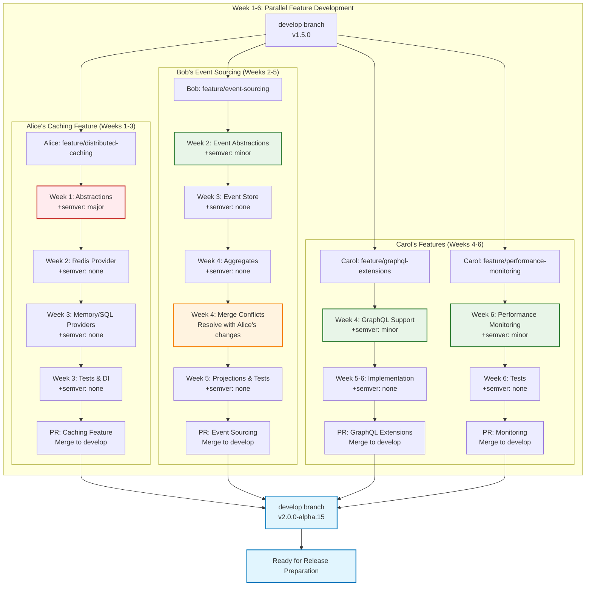
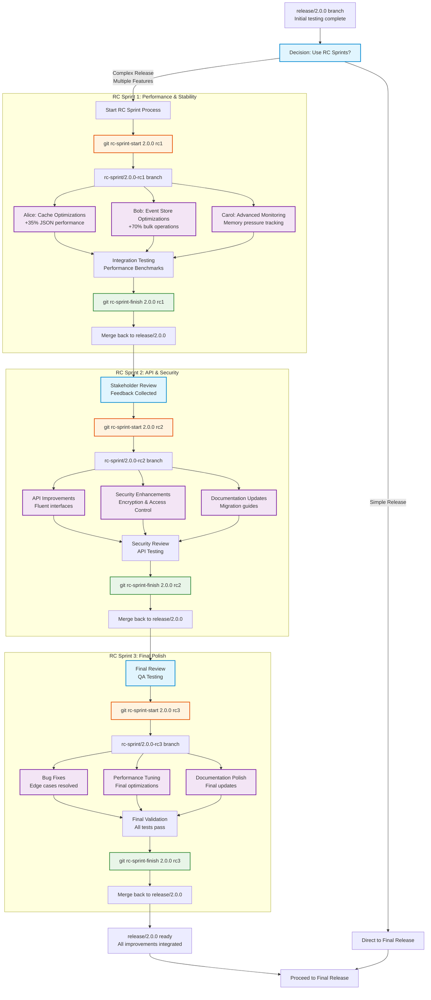
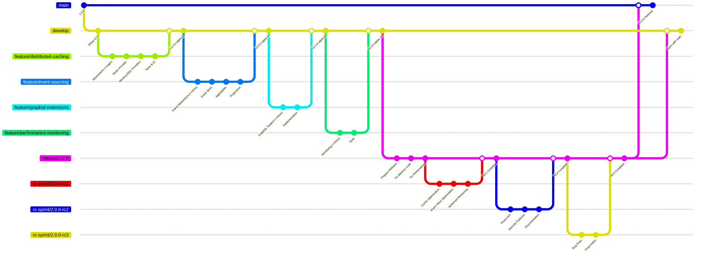
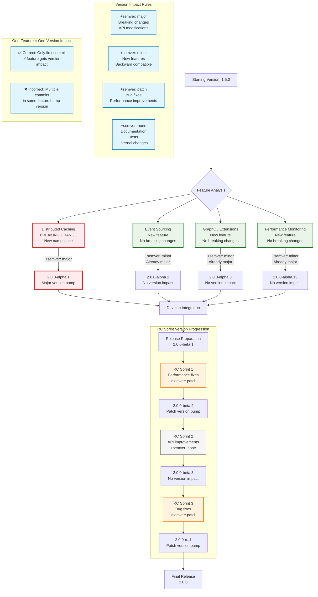

# Development Flow Mermaid Flowcharts

This document contains comprehensive Mermaid flowcharts that visualize the complete development lifecycle from feature development through RC Sprint iterations to final release and package publishing.

## Table of Contents

- [Complete Development Flow Overview](#complete-development-flow-overview)
- [Feature Development Phase](#feature-development-phase)
- [RC Sprint Iteration Process](#rc-sprint-iteration-process)
- [Release and Publishing Flow](#release-and-publishing-flow)
- [GitFlow Branch Strategy](#gitflow-branch-strategy)
- [Semantic Versioning Flow](#semantic-versioning-flow)

---

## Complete Development Flow Overview



---

## Feature Development Phase



---

## RC Sprint Iteration Process



---

## Release and Publishing Flow

```mermaid
graph TD
    A[release/2.0.0<br/>All RC Sprints complete] --> B[Final Pre-Release Validation]
    
    B --> C[Build & Test<br/>dotnet build --configuration Release<br/>dotnet test --configuration Release]
    C --> D[Generate Packages<br/>./build-consolidated-package.sh Release<br/>./build-individual-packages.sh Release]
    D --> E[Package Verification<br/>Check contents and dependencies]
    
    E --> F[git release-finish 2.0.0]
    
    subgraph "Automated Release Process"
        F --> F1[Merge release/2.0.0 → main]
        F1 --> F2[Create tag v2.0.0]
        F2 --> F3[Merge release/2.0.0 → develop]
        F3 --> F4[Delete release/2.0.0 branch]
        F4 --> F5[Push all changes to remote]
    end
    
    F5 --> G[CI/CD Pipeline Triggered<br/>main branch updated]
    
    subgraph "Automated CI/CD Pipeline"
        G --> G1[Checkout main branch]
        G1 --> G2[Restore & Build<br/>.NET 8.0 Release]
        G2 --> G3[Run Full Test Suite<br/>Unit + Integration tests]
        G3 --> G4[Code Coverage Analysis<br/>Security scanning]
        G4 --> G5[Generate Packages<br/>Consolidated + Individual]
        G5 --> G6[Publish to NuGet.org<br/>Stable packages]
        G6 --> G7[Publish to GitHub Packages<br/>Backup distribution]
        G7 --> G8[Create GitHub Release<br/>Auto-generated notes]
        G8 --> G9[Attach packages to release<br/>Download artifacts]
    end
    
    G9 --> H[Manual Release Enhancement]
    H --> H1[gh release create v2.0.0<br/>Comprehensive release notes]
    H1 --> H2[Package Verification<br/>nuget list Idevs.Foundation]
    H2 --> H3[Community Notification<br/>Blog posts, social media]
    
    H3 --> I[Release Complete<br/>v2.0.0 Available]
    
    subgraph "Post-Release Monitoring"
        I --> I1[Monitor Download Stats<br/>NuGet.org analytics]
        I --> I2[Community Feedback<br/>Issues and discussions]
        I --> I3[Performance Monitoring<br/>Production usage metrics]
    end
    
    %% Styling
    classDef preparation fill:#fff3e0,stroke:#f57c00,stroke-width:2px
    classDef automated fill:#e1f5fe,stroke:#0288d1,stroke-width:2px
    classDef manual fill:#f3e5f5,stroke:#7b1fa2,stroke-width:2px
    classDef monitoring fill:#e8f5e8,stroke:#388e3c,stroke-width:2px
    classDef complete fill:#ffebee,stroke:#d32f2f,stroke-width:2px
    
    class B,C,D,E preparation
    class F1,F2,F3,F4,F5,G1,G2,G3,G4,G5,G6,G7,G8,G9 automated
    class H,H1,H2,H3 manual
    class I1,I2,I3 monitoring
    class I complete
```



---

## GitFlow Branch Strategy



---

## Semantic Versioning Flow



---

## Usage Instructions

To use these flowcharts in your documentation:

1. **Copy the Mermaid code** from any section above
2. **Paste it into any Markdown document** that supports Mermaid (GitHub, GitLab, etc.)
3. **Use in documentation tools** like GitBook, Notion, or any Mermaid-compatible renderer
4. **Generate static images** using Mermaid CLI or online tools

### Example Integration

```markdown
## Development Flow Overview

The following diagram shows our complete development lifecycle:

```mermaid
[Insert the Complete Development Flow Overview chart here]
```

Each phase is detailed in the subsequent sections...
```

These flowcharts provide visual clarity for:
- **Team onboarding** and training
- **Process documentation** and guidelines
- **Decision-making** during releases
- **Stakeholder communication** about development lifecycle
- **Quality assurance** and review processes
